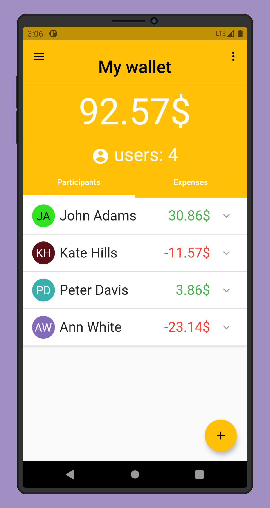

# bill_folder

[Flutter](https://flutter.dev/) application for sharing expenses with your friends - no more lost receipts or complex spreadsheets!

## Quick start

### Development

1. Clone the repo
2. Fetch dependencies
3. Start your device emulator
4. Run the project

```bash
git clone https://github.com/GrzegorzKazana/bill-folder.git
flutter pub get
flutter run
```

### Tests

```bash
flutter test
```

## Demo




